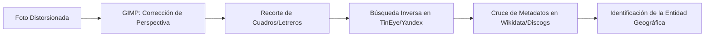

# Guía Maestra de Deducción Visual, OSINT y Verificación Manual V3.0

> [!IMPORTANT]
> **FUENTE DE VERDAD**: Conversación Gemini sobre Deducción Visual y Metodologías OSINT de Código Abierto.
> Este documento representa el **Nivel 4 (Escalamiento Manual - Human-in-the-Loop)** de nuestra arquitectura de geocodificación inversa. Se activa cuando la precisión de las señales de GPS, el OCR automatizado o el análisis fisonómico local por IA cae por debajo del umbral de consenso del 75% y requiere intervención analítica forense.

---

## 🧭 Metodología de Deducción Visual OSINT (Soberana y Libre)

Para lograr una deducción visual precisa utilizando estrictamente fuentes de código abierto, herramientas libres y metodologías OSINT (sin depender de redes sociales comerciales ni plataformas de reseñas corporativas), el sistema enfoca su caja de herramientas en tres pilares de acción:

### 1. Motores de Búsqueda Visual Inversa (Open Access / Libres)
Para identificar fotos individuales dentro de un mosaico o decoración de una pared, no se utiliza la búsqueda web común. Se emplean herramientas avanzadas que permiten aislar regiones específicas de la imagen:

* **Openverse (WordPress / Creative Commons)**: El buscador oficial de la fundación Creative Commons. Permite rastrear si las imágenes originales de los artistas (ej: la foto de The Beatles en Miami) están bajo licencias libres y conocer su procedencia documental exacta.
* **TinEye**: Motor especializado en coincidencias de píxeles exactos (no busca imágenes similares por estética). Es ideal para recortar un cuadro específico de la pared (ej: una foto de Jim Morrison) y encontrar en qué archivos históricos o páginas web de diseño de interiores se ha indexado esa réplica exacta.
* **Yandex Visual Search**: El motor técnicamente más potente para reconocer patrones de fondos, texturas de paredes y configuraciones de cuadros complejos, permitiendo recortar sub-regiones de la imagen con gran precisión.

### 2. Bases de Datos de Código Abierto y Archivos Comunitarios
Una vez aislado un elemento (un disco, una tipografía, una placa, un mural), se cruza con registros comunitarios abiertos para deducir el contexto:

* **Discogs (Base de Datos Musical Abierta)**: Si la imagen muestra un disco de oro o una portada de vinilo, este repositorio comunitario open-source (el más grande del mundo) permite identificar la edición exacta del disco, el año de lanzamiento y el diseño de la etiqueta para verificar su procedencia.
* **Wikimedia Commons y Wikidata**: Útiles para buscar colecciones de fotógrafos originales (ej: archivos liberados de revistas históricas). Si se halla que tres fotos de la pared pertenecen al mismo catálogo de un fotógrafo de rock en Wikimedia, se deduce la temática de la colección.
* **Fonts In Use**: Si se sube un recorte de una placa con tipografía institucional, esta plataforma comunitaria identifica la fuente exacta (`font`). Identificar tipografías corporativas registradas revela con alta probabilidad la empresa matriz o cadena del lugar.

### 3. Herramientas de Extracción y Recorte (Análisis Forense)
Para preparar la imagen antes de pasarla por los buscadores y evitar "ruido" visual causado por la perspectiva:

* **CyberChef (GCHQ)**: La "navaja suiza del analista". Permite extraer de forma segura cadenas de texto ocultas o hashes de la imagen en operaciones puramente locales (open-source) dentro del navegador.
* **GIMP (GNU Image Manipulation Program)**: Software libre de edición. Utilizado obligatoriamente para aplicar la herramienta de **"Corrección de Perspectiva"**. Al enderezar la pared y recortar cada cuadro de forma plana y frontal, se aumenta exponencialmente la efectividad de los motores de búsqueda inversa.

---

## 🔄 El Flujo de Trabajo Recomendado (HITL)

Para resolver conflictos espaciales o fisonómicos complejos:



1. **Corrección de Perspectiva (GIMP)**: Se endereza la perspectiva de la foto y se recorta el cuadro o letrero más nítido.
2. **Búsqueda Inversa (TinEye)**: Se pasa el recorte por TinEye para buscar la procedencia y publicación de la fotografía original.
3. **Cruce de Datos (Wikidata / Discogs)**: Se cruzan los datos del fotógrafo, álbum o tipografía para entender la identidad cultural de la colección y deducir el local o Landmark geográfico exacto.

---

## 💻 Integración en la Arquitectura de Reverse-Geocoding

Este flujo OSINT no solo es un manual para el usuario, sino que se integra en nuestro sistema a través de la interfaz de validación cuando el algoritmo automático detecta una alerta de baja confianza:

### 1. Detección de Fallo de Consenso (Consensus Failure)
Cuando las coordenadas estimadas no tienen suficientes POIs coincidentes o el motor de micro-fisonomía detecta un conflicto temporal/velocidad (ej. 7 segundos de traslado imposibles):
```javascript
if (consensus.confidence_score < 0.75) {
  return {
    status: 'PENDING_HUMAN_VALIDATION',
    requiresManualValidation: true,
    reason: 'CONCENSUS_FAILURE_OR_VELOCITY_VETO',
    osint_tools: ['tineye', 'yandex_visual', 'wikidata', 'discogs']
  };
}
```

### 2. Acceso Rápido desde el Panel de Auditoría (`AuditCard.jsx`)
Para los casos donde el sistema marque `PENDING_HUMAN_VALIDATION`, agregamos botones de acceso rápido que permiten al operador recortar una porción de la imagen en pantalla y enviarla de manera directa con un clic a los buscadores sugeridos, acelerando la verificación manual.

> [!TIP]
> **Privacidad Asegurada**: Al mantener este flujo bajo herramientas de código abierto o portales de consulta directa que respeten la privacidad (como Openverse y TinEye), cumplimos con el principio de **Minimización de Datos**, persistiendo únicamente la coordenada verificada redondeada a 4 decimales (~11m de precisión) en nuestra caché espacial.

---

## 🏛️ IV. Sinergia de Arquitectura con el Arquitecto de Reverse Geocoding

Para garantizar la viabilidad técnica y el cumplimiento de las políticas de costo cero ($0) y máxima soberanía local (H3 Res 9) en cada cambio lógico o estructural:

### 1. Proceso de Consulta Mandatario
Antes de la creación de cualquier `implementation_plan.md` o de abordar modificaciones complejas, el agente de IA tiene la obligación estricta de invocar al Arquitecto de Reverse Geocoding mediante la herramienta MCP `consult_architect_llm`.

### 2. Contrato de Diseño
Toda consulta técnica con el Arquitecto se contrastará con la base de conocimiento de la carpeta `REVERSE_GEOCODING` de NotebookLM. El diseño de software implementado debe respetar escrupulosamente los siguientes tres pilares:
* **Diseño Modular y Desacoplado**: Tareas lógicas (como la inferencia de "Verdad del Lugar") divididas en micro-módulos aislados y testeables de manera autónoma.
* **Eficiencia y Soberanía Local (SpatialCache)**: Priorización absoluta de la caché local indexada hexagonalmente (H3 Res 9) y geocache local antes de invocar APIs externas de pago.
* **Salida Interoperable**: Las respuestas del Arquitecto culminan obligatoriamente con una sección autocontenida y procesable bajo la etiqueta `INSTRUCCIÓN PARA EL AGENTE`, la cual es de ejecución prioritaria para AntiGravity.

